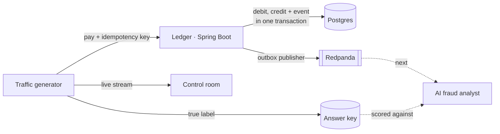
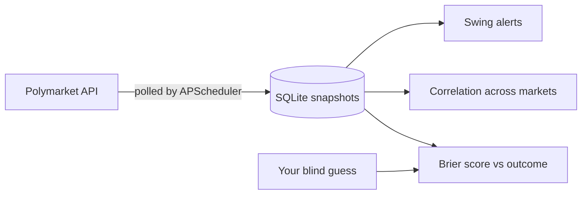
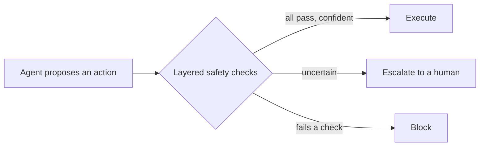

**Software engineer · CS graduate, Newcastle University · Looking for 2027 grad roles in bank & fintech tech**

---

I like problems where a number *looks* right but might not be. That's taken me into prediction markets, explainable pricing models, a from-scratch bank ledger where the books have to balance after every single test, and a dissertation on stopping AI agents from doing something stupid with money.

## 🎲 Quick calibration test

Before you scroll, try the thing my projects are built around. Make a guess, then click to check.

<b>Q1.</b> I say a market has a 70% chance of YES. It resolves NO. What's my Brier score? (lower is better)

 

**0.49.** Brier score = (forecast − outcome)², so (0.7 − 0)² = 0.49.
If I'd hedged at 50% I'd have scored 0.25, and if I'd said 10% I'd have scored 0.01. Confidence only pays when you're right, which is exactly what [Split Decision](https://github.com/KevST14/SplitDecision) tracks over time.

<b>Q2.</b> You tap "pay", your phone loses signal, and the app sends the request again. How many times should you be charged?

 

**Once.** Every payment carries an *idempotency key*, so a retry returns the original transfer instead of paying twice. In [Clearhouse](https://github.com/KevST14/clearhouse) I test this by firing 20 identical requests at the same key from eight threads at once. Exactly one goes through.

<b>Q3.</b> Pricing a London Airbnb: what helps the model more, <i>where</i> it is or <i>how the listing is written</i>?

 

**Where it is.** Adding location features (distance to stations, parks, food) pushed R² from 0.62 to 0.65. Analysing the listing text added only about £1–2 a night. Clever copywriting doesn't change much. [See for yourself in the live demo ↗](https://london-rent-reality-check-jikdwpaozdee8hvjjccgaa.streamlit.app)

<b>Q4.</b> An AI agent is 60% sure a payment is legit. Should it send the money?

 

**Not on its own.** That's the question my dissertation is about: stack independent checks, and when the agent's uncertainty crosses a threshold, it escalates to a human instead of guessing. Scroll down for the diagram.

## 🔨 Things I've built

<h3>🏦 Clearhouse: a tiny bank, and the fraud hiding in it</h3>

-E4405F?style=flat-square&logo=apachekafka&logoColor=white)

A small, working model of a bank's back office. A double-entry ledger moves money in whole pence with idempotency keys and row locking, a transactional outbox announces every transfer on an event stream, and a simulated town of 120 customers and 22 shops pays its way through it. Then you can launch fraud on demand (card testing, a money mule ring, an account takeover) and watch each one draw its own shape in a live control room.

<picture>
  <source media="(prefers-color-scheme: dark)" srcset="https://raw.githubusercontent.com/KevST14/clearhouse/main/docs/dashboard-dark.png">
  
</picture>

- **The books must balance:** after *every* test, every transfer nets to zero and every currency sums to zero, checked against real Postgres via Testcontainers.
- **Learned the hard way:** optimistic locking fell over on hot accounts under an 8-thread test, so I switched to ordered pessimistic locks. CI on Linux also caught a nanosecond-vs-microsecond timestamp bug my Mac never showed.
- **Next up:** a dbt/DuckDB pipeline over the event stream, then an AI fraud analyst graded on precision and recall against the answer key.

**[→ View repo](https://github.com/KevST14/clearhouse)**

<h3>📈 Split Decision: can you beat a prediction market?</h3>

Watches Polymarket, snapshots prices on a schedule, and alerts when odds swing hard. The fun part: lock in your own probability *before* you see the market price, then get scored against the real outcome.

**[→ View repo](https://github.com/KevST14/SplitDecision)**

<h3>🏠 Rent Reality Check: is that Airbnb a fair price?</h3>

Give it a London short-let and it predicts a fair nightly price from Inside Airbnb and OpenStreetMap data, then shows *why* with a SHAP breakdown. It's spatially cross-validated, so it can't cheat by memorising neighbourhoods.

| R² (held-out) | Median error | Mean error |
|:---:|:---:|:---:|
| **0.72** | **22%** | **~£60/night** |

**[→ Try the live demo](https://london-rent-reality-check-jikdwpaozdee8hvjjccgaa.streamlit.app)** · **[View repo](https://github.com/KevST14/london-rent-reality-check)**

<h3>📰 Patch Notes: patch notes for the tech world</h3>

A personal news dashboard that pulls the day's stories from Hacker News, Lobsters, GitHub and a dozen outlets, groups coverage of the same story, learns what you care about, and spots the names that are suddenly everywhere. No accounts, no API keys, no tracking.

- **Story clustering:** TF-IDF headline similarity with name boosting and centroid matching, so three outlets covering one earnings call become one card, while two different "critical flaw" stories stay apart.
- **An explainable "For You" feed:** a transparent average over keeps, skips and saves that tells you *why* each story is there. No black box.
- **Trend radar:** terms showing up more than usual across at least two sources, measured against a per-source baseline so a fresh install doesn't think everything is exploding.
- **Plus:** a swipeable catch-up deck with hand-rolled spring physics, and a weekly headline quiz.

**[→ View repo](https://github.com/KevST14/patchnotes)**

<h3>💷 SpendSync: personal finance dashboard</h3>

Track spending and income, set category budgets and savings goals, and automate recurring transactions, all behind a typed, Zod-validated REST API.

**[→ View repo](https://github.com/KevST14/SpendSync)**

<h3>🎓 Dissertation: when should an AI agent stop and ask?</h3>

*Design and Evaluation of a Layered Safety Architecture for Autonomous Financial Execution Agents* (2026)

Rather than trusting one model to get it right, the architecture puts independent checks between the agent and the money and treats uncertainty as a reason to hand over to a human.

## 🧰 Toolkit

## 🐍 Contributions

<picture>
  <source media="(prefers-color-scheme: dark)" srcset="https://raw.githubusercontent.com/KevST14/KevST14/output/github-contribution-grid-snake-dark.svg" />
  
</picture>

---

<i>Happy to chat about markets, models, ledgers, or agents that know their limits.</i>

